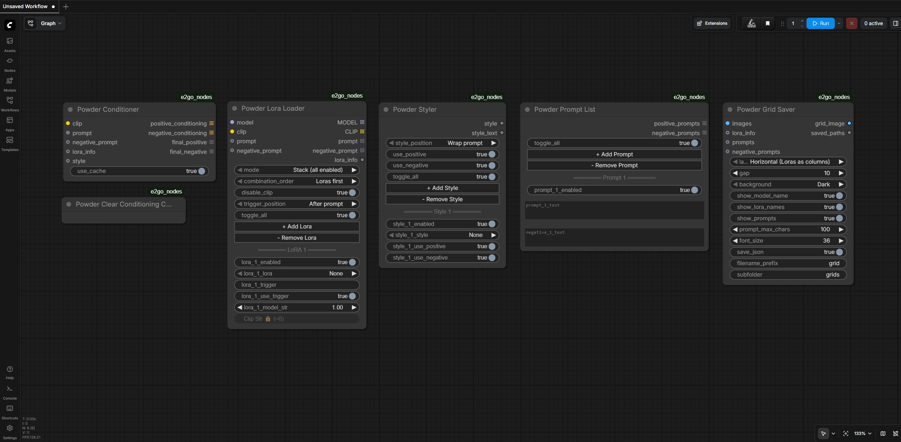
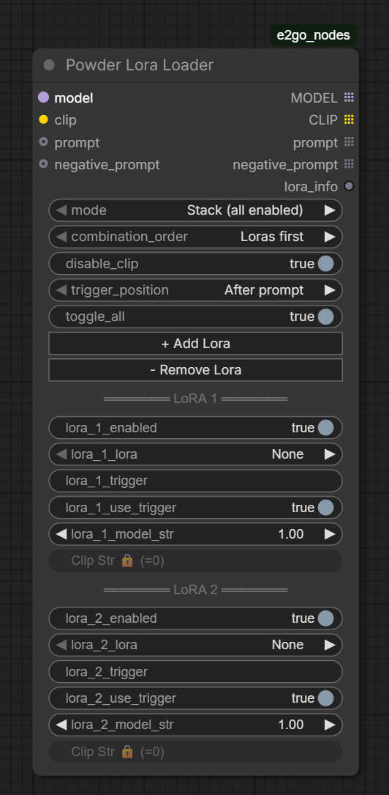
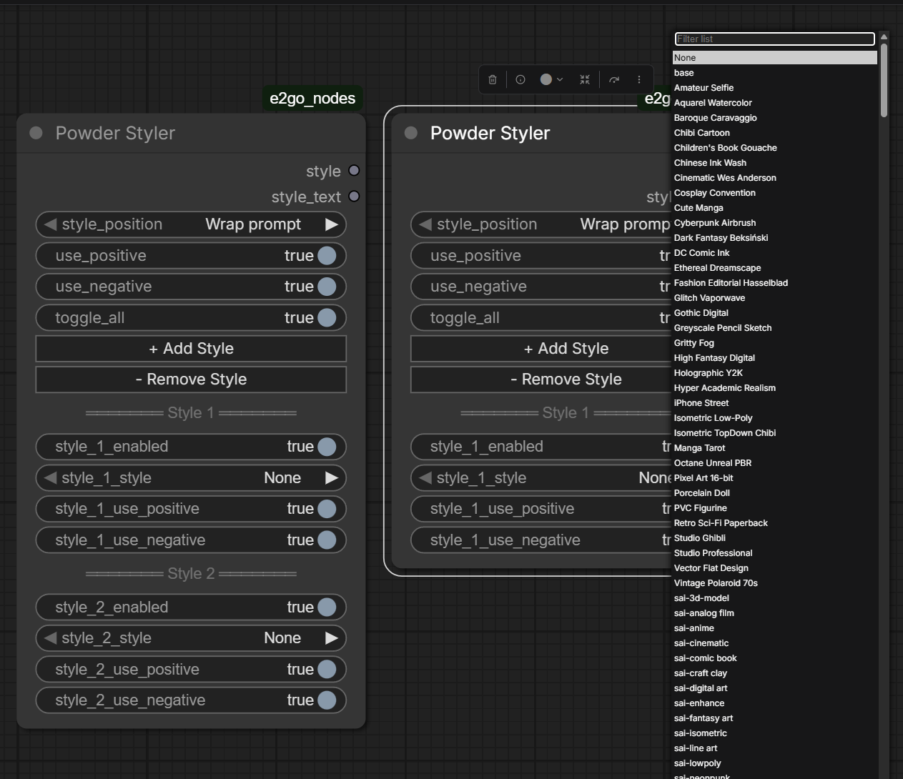
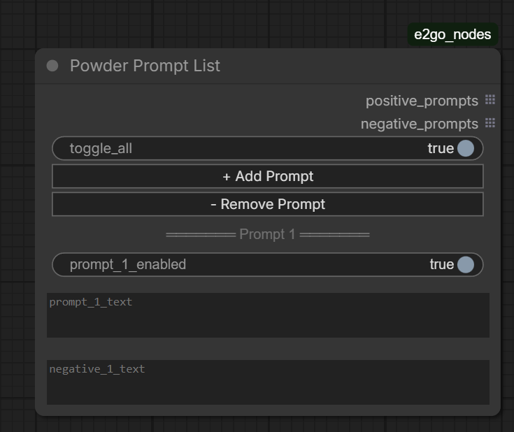
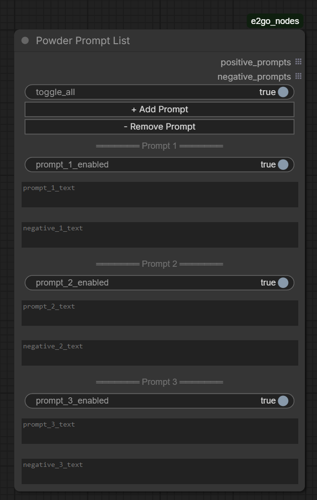
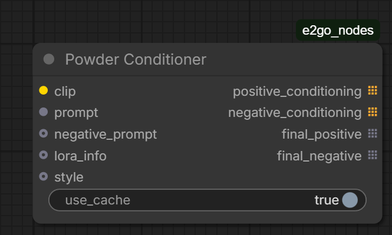
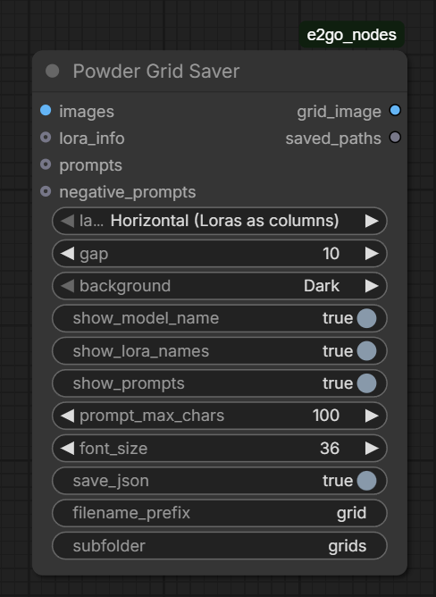
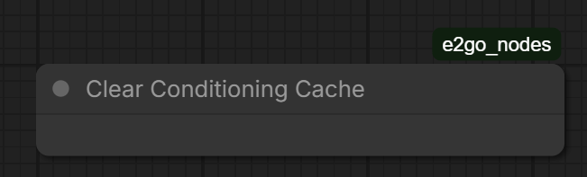

# E2GO Nodes for ComfyUI

**[English](#english)** | **[Русский](#русский)**

---

<a id="english"></a>

A set of optimized nodes for ComfyUI designed for convenient work with LoRA, styles, prompts, and grid assembly. Compatible with ComfyUI v0.17+.

> [!NOTE]
> **Tested with:** ComfyUI 0.17.2 | Frontend 1.41.20 | Python 3.12 | PyTorch 2.10 + CUDA 13.0 | Windows 11 | NVIDIA RTX 5090
>
> May work with other versions, but these are the only ones verified. If you encounter issues on a different setup, please [open an issue](https://github.com/E2GO/e2go-comfyui-nodes/issues).



## Installation

### Option 1: Git Clone (recommended)

```bash
cd ComfyUI/custom_nodes
git clone https://github.com/E2GO/e2go-comfyui-nodes.git e2go_nodes
```

Restart ComfyUI.

### Option 2: ComfyUI Manager

1. Open ComfyUI Manager
2. Click "Install Custom Nodes"
3. Search for `e2go_nodes` or `E2GO`
4. Click Install, restart ComfyUI

### Option 3: Manual

Download the [latest release](https://github.com/E2GO/e2go-comfyui-nodes/archive/refs/heads/master.zip), extract to `ComfyUI/custom_nodes/e2go_nodes/`, restart ComfyUI.

## Nodes

- [Powder Lora Loader](#powder-lora-loader) — loading and combining LoRA
- [Powder Styler](#powder-styler) — applying styles from a library
- [Powder Prompt List](#powder-prompt-list) — managing a list of prompts
- [Powder Conditioner](#powder-conditioner) — assembling and encoding the final prompt
- [Powder Grid Save](#powder-grid-save) — assembling images into a labeled grid
- [Powder Clear Conditioning Cache](#powder-clear-conditioning-cache) — clearing the encoding cache

---

### Powder Lora Loader



Loads one or more LoRAs with caching, trigger support, and two operating modes.

#### Inputs

| Input | Type | Required | Description |
|-------|------|:---:|-------------|
| **model** | MODEL | yes | Base model |
| **clip** | CLIP | yes | CLIP model for text encoding |
| **mode** | combo | yes | `Stack (all enabled)` — all LoRAs into one model. `Single` — each LoRA separately (for comparison) |
| **combination_order** | combo | yes | `Loras first` — LoRAs first, then prompts. `Prompts first` — reverse. Affects output combination order in Single mode |
| **disable_clip** | boolean | yes | Skip CLIP weights when loading LoRA (faster for testing) |
| **trigger_position** | combo | yes | `After prompt` / `Before prompt` — where to place LoRA trigger text |
| **prompt** | STRING | no | Input prompt (connected via wire) |
| **negative_prompt** | STRING | no | Negative prompt (connected via wire) |

#### Dynamic Slots (on the node)

Use `+ Add Lora` / `- Remove Lora` buttons to add slots (up to 20). Each slot:
- **Enabled** — on/off
- **LoRA** — select LoRA file
- **Trigger** — trigger text (auto-loaded from `.txt` file next to the LoRA)
- **Use Trigger** — whether to use the trigger
- **Model Str** / **Clip Str** — application strength

#### Outputs

| Output | Type | List | Description |
|--------|------|:---:|-------------|
| **MODEL** | MODEL | yes | Model(s) with applied LoRAs |
| **CLIP** | CLIP | yes | CLIP with applied LoRAs (or original when disable_clip is on) |
| **prompt** | STRING | yes | Prompts (one per combination) |
| **negative_prompt** | STRING | yes | Negative prompts |
| **lora_info** | STRING | no | JSON with metadata: LoRA names, strengths, triggers, order |

#### Modes

**Stack** — all enabled LoRAs are applied sequentially to one model. Output is one model repeated for each prompt.

**Single** — each LoRA creates its own model copy. Output is N_loras x N_prompts combinations. Great for style comparison via Grid.

---

### Powder Styler



Applies styles from a library of JSON files. Each style contains a prefix (added before the prompt), suffix (after), and negative (added to the negative prompt).

#### Inputs

| Input | Type | Required | Description |
|-------|------|:---:|-------------|
| **style_position** | combo | yes | `Wrap prompt` — prefix + prompt + suffix. `Before prompt` — prefix + suffix + prompt. `After prompt` — prompt + prefix + suffix |
| **use_positive** | boolean | yes | Apply positive part of styles |
| **use_negative** | boolean | yes | Apply negative part of styles |

#### Dynamic Slots (on the node)

Use `+ Add Style` / `- Remove Style` buttons to add slots (up to 20). Each slot:
- **Enabled** — on/off
- **Style** — select style from the library
- **Use Positive** / **Use Negative** — use positive/negative for this slot

#### Outputs

| Output | Type | Description |
|--------|------|-------------|
| **style** | STRING | JSON with prefix, suffix, negative, and position — connect to Conditioner |
| **style_text** | STRING | Combined style text (prefix + suffix) |

#### Adding Custom Styles

Create a JSON file in the `e2go_nodes/styles/` folder. Format:

```json
[
  {
    "name": "My Cool Style",
    "prefix": "text before prompt",
    "suffix": "text after prompt",
    "negative": "added to negative prompt"
  },
  {
    "name": "Another Style",
    "prefix": "",
    "suffix": "in style of impressionism, oil on canvas",
    "negative": "digital, 3d, photorealistic"
  }
]
```

The old SDXL Prompt Styler format is also supported:

```json
[
  {
    "name": "Old Format Style",
    "prompt": "prefix text, {prompt} . suffix text",
    "negative_prompt": "negative tags"
  }
]
```

The file is automatically picked up on ComfyUI restart. The filename doesn't matter — any `.json` in the `styles/` folder works.

---

### Powder Prompt List





Manages a list of prompts with the ability to enable/disable each slot. Useful for batch generation of multiple scenes.

#### Inputs

Only dynamic slots on the node.

#### Dynamic Slots (on the node)

Use `+ Add Prompt` / `- Remove Prompt` buttons to add slots (up to 20). Each slot:
- **Enabled** — on/off
- **Prompt text** — prompt text (multiline)
- **Negative text** — negative prompt (multiline)

#### Outputs

| Output | Type | List | Description |
|--------|------|:---:|-------------|
| **positive_prompts** | STRING | yes | List of enabled prompts |
| **negative_prompts** | STRING | yes | List of negative prompts |

---

### Powder Conditioner



Central node: assembles the prompt, LoRA triggers, and styles into the final text, then encodes via CLIP. Caches results for repeated runs.

#### Inputs

| Input | Type | Required | Description |
|-------|------|:---:|-------------|
| **clip** | CLIP | yes | CLIP model (usually from Lora Loader) |
| **prompt** | STRING | yes | Prompt(s) — connected via wire |
| **negative_prompt** | STRING | no | Negative prompt(s) — connected via wire |
| **lora_info** | STRING | no | JSON from Lora Loader — contains triggers and their position |
| **style** | STRING | no | JSON from Styler — contains prefix, suffix, negative |
| **use_cache** | boolean | no | Cache encoding results (default: yes) |

#### Outputs

| Output | Type | List | Description |
|--------|------|:---:|-------------|
| **positive_conditioning** | CONDITIONING | yes | Encoded positive prompt |
| **negative_conditioning** | CONDITIONING | yes | Encoded negative prompt |
| **final_positive** | STRING | yes | Final positive prompt text (for debugging) |
| **final_negative** | STRING | yes | Final negative prompt text (for debugging) |

#### Prompt Assembly

The Conditioner assembles the final prompt from parts:

1. **Style** (prefix / suffix) — from the `style` input
2. **Prompt** — from the `prompt` input
3. **Trigger** — from the `lora_info` input

Order is determined by settings:
- `trigger_position` (from lora_info): before/after — trigger at the beginning or end
- `style_position` (from style): wrap/before/after — how the style wraps the prompt

Example with `wrap` + `after`: `style_prefix, prompt, style_suffix, trigger`

---

### Powder Grid Save



Assembles images into a grid with labels (model, LoRA, prompts). Saves to file.

#### Inputs

| Input | Type | Required | Description |
|-------|------|:---:|-------------|
| **images** | IMAGE | yes | Images for the grid |
| **layout** | combo | yes | `Horizontal (Loras as columns)` or `Vertical (Loras as rows)` |
| **gap** | INT | yes | Gap between cells (px) |
| **background** | combo | yes | `Dark` / `Light` |
| **show_model_name** | boolean | yes | Show model name |
| **show_lora_names** | boolean | yes | Show LoRA names |
| **show_prompts** | boolean | yes | Show prompts |
| **prompt_max_chars** | INT | yes | Max prompt length in label |
| **font_size** | INT | yes | Font size |
| **save_json** | boolean | yes | Save JSON with metadata |
| **filename_prefix** | STRING | yes | Filename prefix |
| **subfolder** | STRING | yes | Subfolder in output |
| **lora_info** | STRING | no | JSON from Lora Loader |
| **prompts** | STRING | no | Prompts for labels |
| **negative_prompts** | STRING | no | Negative prompts |

#### Outputs

| Output | Type | Description |
|--------|------|-------------|
| **grid_image** | IMAGE | Assembled grid as tensor |
| **saved_paths** | STRING | Paths to saved files |

#### Fonts

For a custom font, place a `.ttf` file in the `e2go_nodes/fonts/` folder. The node automatically picks up the first TTF file found. If no fonts are present, the system default is used.

---

### Powder Clear Conditioning Cache



Utility node for clearing the Powder Conditioner encoding cache. Useful when switching models or to free memory.

#### Inputs

None.

#### Outputs

None (output node).

---

## Typical Connection Diagram

```
+--------------------+
| Powder Prompt List |
|                    |
|  prompt_1: "..."   |
|  prompt_2: "..."   |
+--+-------------+---+
   | prompts     | negatives
   v             v
+--------------------+    +-----------------+
| Powder Lora Loader |<---| UNETLoader      | model
|                    |<---| CLIPLoader      | clip
|  LoRA 1: style_x  |    +-----------------+
|  LoRA 2: style_y  |
+--+--+--+--+--+----+
   |  |  |  |  | lora_info
   |  |  |  |  v
   |  |  |  |  +----------------------+
   |  |  |  |  | Powder Conditioner   |<-- style (from Styler)
   |  |  |  +--| prompt               |
   |  |  +-----| negative_prompt      |
   |  +---------| clip                |
   |            +--+--------------+---+
   |               | positive     | negative
   |               v              v
   |            +----------------------+
   +----------->| CFGGuider /          |
      model     | KSampler            |
                +----------------------+

+-----------------+
| Powder Styler   |
|                 |
|  Style 1: ...   |---- style --> Conditioner
+-----------------+
```

## Usage Scenarios

See **[Usage Guide](docs/USAGE_GUIDE.md)** for detailed scenarios: simple generation with styles, LoRA comparison grids, batch prompts, cache optimization, and more.

## Example Workflow

The `examples/` folder contains `powder_nodes_test_workflow.json` — import it into ComfyUI via the Load menu.

---

<a id="русский"></a>

# E2GO Nodes для ComfyUI

**[English](#english)** | **[Русский](#русский)**

Набор оптимизированных нод для ComfyUI, разработанный для удобной работы с LoRA, стилями, промптами и grid-сборкой. Совместим с ComfyUI v0.17+.

> [!NOTE]
> **Протестировано на:** ComfyUI 0.17.2 | Frontend 1.41.20 | Python 3.12 | PyTorch 2.10 + CUDA 13.0 | Windows 11 | NVIDIA RTX 5090
>
> Может работать с другими версиями, но проверены только указанные. При проблемах на другой конфигурации — [создайте issue](https://github.com/E2GO/e2go-comfyui-nodes/issues).

## Установка

### Вариант 1: Git Clone (рекомендуется)

```bash
cd ComfyUI/custom_nodes
git clone https://github.com/E2GO/e2go-comfyui-nodes.git e2go_nodes
```

Перезапустите ComfyUI.

### Вариант 2: ComfyUI Manager

1. Откройте ComfyUI Manager
2. Нажмите "Install Custom Nodes"
3. Найдите `e2go_nodes` или `E2GO`
4. Нажмите Install, перезапустите ComfyUI

### Вариант 3: Вручную

Скачайте [последнюю версию](https://github.com/E2GO/e2go-comfyui-nodes/archive/refs/heads/master.zip), распакуйте в `ComfyUI/custom_nodes/e2go_nodes/`, перезапустите ComfyUI.

## Ноды

- [Powder Lora Loader](#powder-lora-loader-1) — загрузка и комбинирование LoRA
- [Powder Styler](#powder-styler-1) — применение стилей из библиотеки
- [Powder Prompt List](#powder-prompt-list-1) — управление списком промптов
- [Powder Conditioner](#powder-conditioner-1) — сборка и кодирование финального промпта
- [Powder Grid Save](#powder-grid-save-1) — сборка изображений в grid с подписями
- [Powder Clear Conditioning Cache](#powder-clear-conditioning-cache-1) — очистка кэша кодирования

---

### Powder Lora Loader


Загружает одну или несколько LoRA с кэшированием, поддержкой триггеров и двумя режимами работы.

#### Входы

| Вход | Тип | Обязательный | Описание |
|------|-----|:---:|----------|
| **model** | MODEL | да | Базовая модель |
| **clip** | CLIP | да | CLIP-модель для кодирования текста |
| **mode** | combo | да | `Stack (all enabled)` — все LoRA в одну модель. `Single` — каждая LoRA отдельно (для сравнения) |
| **combination_order** | combo | да | `Loras first` — сначала LoRA, потом промпты. `Prompts first` — наоборот. Влияет на порядок выходных комбинаций в Single-режиме |
| **disable_clip** | boolean | да | Пропустить CLIP-веса при загрузке LoRA (быстрее для тестирования) |
| **trigger_position** | combo | да | `After prompt` / `Before prompt` — куда поставить триггер-текст LoRA |
| **prompt** | STRING | нет | Входной промпт (подключается проводом) |
| **negative_prompt** | STRING | нет | Негативный промпт (подключается проводом) |

#### Динамические слоты (на ноде)

Кнопками `+ Add Lora` / `- Remove Lora` добавляются слоты (до 20). Каждый слот:
- **Enabled** — вкл/выкл
- **LoRA** — выбор файла LoRA
- **Trigger** — триггер-текст (автозагрузка из `.txt` рядом с файлом LoRA)
- **Use Trigger** — использовать триггер
- **Model Str** / **Clip Str** — сила применения

#### Выходы

| Выход | Тип | Список | Описание |
|-------|-----|:---:|----------|
| **MODEL** | MODEL | да | Модель(и) с применёнными LoRA |
| **CLIP** | CLIP | да | CLIP с применёнными LoRA (или оригинальный при disable_clip) |
| **prompt** | STRING | да | Промпты (один на комбинацию) |
| **negative_prompt** | STRING | да | Негативные промпты |
| **lora_info** | STRING | нет | JSON с метаданными: имена LoRA, силы, триггеры, порядок |

#### Режимы

**Stack** — все включённые LoRA применяются последовательно к одной модели. На выходе одна модель, повторённая для каждого промпта.

**Single** — каждая LoRA создаёт свою копию модели. На выходе N_loras x N_prompts комбинаций. Удобно для сравнения стилей через Grid.

---

### Powder Styler


Применяет стили из библиотеки JSON-файлов. Каждый стиль содержит prefix (добавляется перед промптом), suffix (после) и negative (добавляется к негативному промпту).

#### Входы

| Вход | Тип | Обязательный | Описание |
|------|-----|:---:|----------|
| **style_position** | combo | да | `Wrap prompt` — prefix + prompt + suffix. `Before prompt` — prefix + suffix + prompt. `After prompt` — prompt + prefix + suffix |
| **use_positive** | boolean | да | Применять положительную часть стилей |
| **use_negative** | boolean | да | Применять негативную часть стилей |

#### Динамические слоты (на ноде)

Кнопками `+ Add Style` / `- Remove Style` добавляются слоты (до 20). Каждый слот:
- **Enabled** — вкл/выкл
- **Style** — выбор стиля из библиотеки
- **Use Positive** / **Use Negative** — использовать позитив/негатив этого слота

#### Выходы

| Выход | Тип | Описание |
|-------|-----|----------|
| **style** | STRING | JSON с prefix, suffix, negative и position — подключается к Conditioner |
| **style_text** | STRING | Объединённый текст стиля (prefix + suffix) |

#### Добавление собственных стилей

Создайте JSON-файл в папке `e2go_nodes/styles/`. Формат:

```json
[
  {
    "name": "My Cool Style",
    "prefix": "текст перед промптом",
    "suffix": "текст после промпта",
    "negative": "то что добавится в негатив"
  },
  {
    "name": "Another Style",
    "prefix": "",
    "suffix": "in style of impressionism, oil on canvas",
    "negative": "digital, 3d, photorealistic"
  }
]
```

Также поддерживается старый формат SDXL Prompt Styler:

```json
[
  {
    "name": "Old Format Style",
    "prompt": "prefix text, {prompt} . suffix text",
    "negative_prompt": "negative tags"
  }
]
```

Файл автоматически подхватывается при перезапуске ComfyUI. Имя файла не важно, главное — `.json` в папке `styles/`.

---

### Powder Prompt List


Управляет списком промптов с возможностью включения/выключения каждого слота. Удобно для batch-генерации нескольких сцен.

#### Входы

Только динамические слоты на ноде.

#### Динамические слоты (на ноде)

Кнопками `+ Add Prompt` / `- Remove Prompt` добавляются слоты (до 20). Каждый слот:
- **Enabled** — вкл/выкл
- **Prompt text** — текст промпта (multiline)
- **Negative text** — негативный промпт (multiline)

#### Выходы

| Выход | Тип | Список | Описание |
|-------|-----|:---:|----------|
| **positive_prompts** | STRING | да | Список включённых промптов |
| **negative_prompts** | STRING | да | Список негативных промптов |

---

### Powder Conditioner


Центральная нода: собирает промпт, триггеры LoRA и стили в финальный текст, затем кодирует через CLIP. Кэширует результаты для повторных запусков.

#### Входы

| Вход | Тип | Обязательный | Описание |
|------|-----|:---:|----------|
| **clip** | CLIP | да | CLIP-модель (обычно из Lora Loader) |
| **prompt** | STRING | да | Промпт(ы) — подключается проводом |
| **negative_prompt** | STRING | нет | Негативный промпт(ы) — подключается проводом |
| **lora_info** | STRING | нет | JSON от Lora Loader — содержит триггеры и их позицию |
| **style** | STRING | нет | JSON от Styler — содержит prefix, suffix, negative |
| **use_cache** | boolean | нет | Кэшировать результаты кодирования (по умолчанию: да) |

#### Выходы

| Выход | Тип | Список | Описание |
|-------|-----|:---:|----------|
| **positive_conditioning** | CONDITIONING | да | Закодированный положительный промпт |
| **negative_conditioning** | CONDITIONING | да | Закодированный негативный промпт |
| **final_positive** | STRING | да | Финальный текст положительного промпта (для отладки) |
| **final_negative** | STRING | да | Финальный текст негативного промпта (для отладки) |

#### Сборка промпта

Conditioner собирает финальный промпт из частей:

1. **Стиль** (prefix / suffix) — из `style` входа
2. **Промпт** — из `prompt` входа
3. **Триггер** — из `lora_info` входа

Порядок определяется настройками:
- `trigger_position` (из lora_info): before/after — триггер в начале или конце
- `style_position` (из style): wrap/before/after — как стиль оборачивает промпт

Пример при `wrap` + `after`: `style_prefix, prompt, style_suffix, trigger`

---

### Powder Grid Save


Собирает изображения в grid с подписями (модель, LoRA, промпты). Сохраняет в файл.

#### Входы

| Вход | Тип | Обязательный | Описание |
|------|-----|:---:|----------|
| **images** | IMAGE | да | Изображения для grid |
| **layout** | combo | да | `Horizontal (Loras as columns)` или `Vertical (Loras as rows)` |
| **gap** | INT | да | Отступ между ячейками (px) |
| **background** | combo | да | `Dark` / `Light` |
| **show_model_name** | boolean | да | Показывать имя модели |
| **show_lora_names** | boolean | да | Показывать имена LoRA |
| **show_prompts** | boolean | да | Показывать промпты |
| **prompt_max_chars** | INT | да | Макс. длина промпта в подписи |
| **font_size** | INT | да | Размер шрифта |
| **save_json** | boolean | да | Сохранить JSON с метаданными |
| **filename_prefix** | STRING | да | Префикс имени файла |
| **subfolder** | STRING | да | Подпапка в output |
| **lora_info** | STRING | нет | JSON от Lora Loader |
| **prompts** | STRING | нет | Промпты для подписей |
| **negative_prompts** | STRING | нет | Негативные промпты |

#### Выходы

| Выход | Тип | Описание |
|-------|-----|----------|
| **grid_image** | IMAGE | Собранный grid как тензор |
| **saved_paths** | STRING | Пути к сохранённым файлам |

#### Шрифты

Для пользовательского шрифта положите `.ttf` файл в папку `e2go_nodes/fonts/`. Нода автоматически найдёт первый TTF-файл. Если шрифтов нет — используется системный.

---

### Powder Clear Conditioning Cache


Вспомогательная нода для очистки кэша кодирования Powder Conditioner. Полезно при смене модели или для освобождения памяти.

#### Входы

Нет.

#### Выходы

Нет (output node).

---

## Типичная схема подключения

```
+--------------------+
| Powder Prompt List |
|                    |
|  prompt_1: "..."   |
|  prompt_2: "..."   |
+--+-------------+---+
   | prompts     | negatives
   v             v
+--------------------+    +-----------------+
| Powder Lora Loader |<---| UNETLoader      | model
|                    |<---| CLIPLoader      | clip
|  LoRA 1: style_x  |    +-----------------+
|  LoRA 2: style_y  |
+--+--+--+--+--+----+
   |  |  |  |  | lora_info
   |  |  |  |  v
   |  |  |  |  +----------------------+
   |  |  |  |  | Powder Conditioner   |<-- style (от Styler)
   |  |  |  +--| prompt               |
   |  |  +-----| negative_prompt      |
   |  +---------| clip                |
   |            +--+--------------+---+
   |               | positive     | negative
   |               v              v
   |            +----------------------+
   +----------->| CFGGuider /          |
      model     | KSampler            |
                +----------------------+

+-----------------+
| Powder Styler   |
|                 |
|  Style 1: ...   |---- style --> Conditioner
+-----------------+
```

## Сценарии использования

Подробные сценарии — в **[Гайде по использованию](docs/USAGE_GUIDE.md)**: простая генерация со стилями, сравнительные grid LoRA, batch-промпты, оптимизация кэша и другое.

## Пример workflow

В папке `examples/` есть `powder_nodes_test_workflow.json` — импортируйте его в ComfyUI через меню Load.
